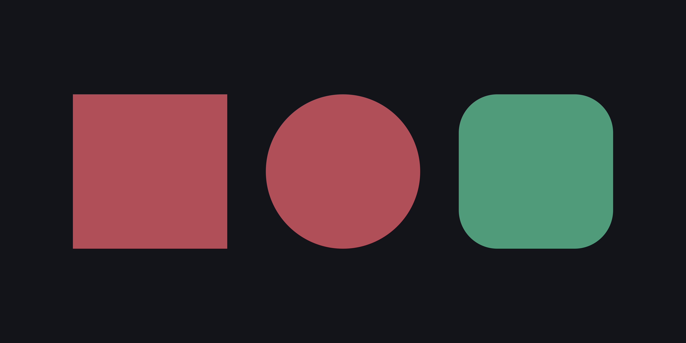
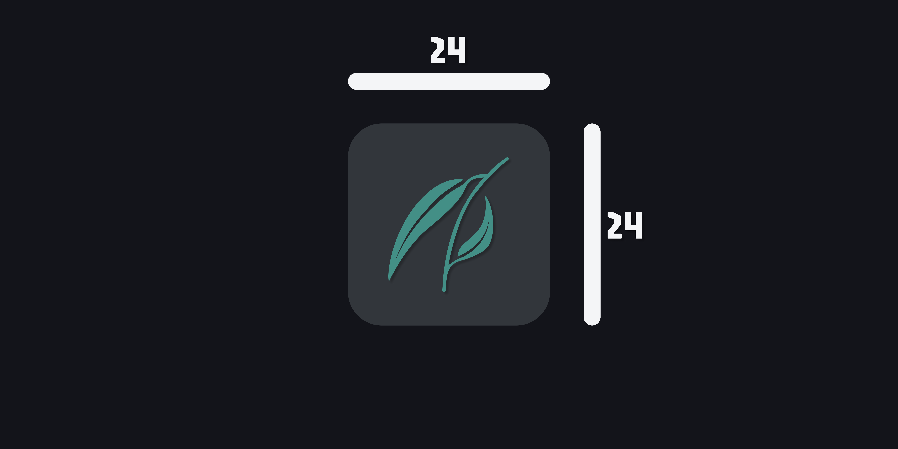

# Contributing to Willow Icons

## License

By submitting a pull request, you agree that your contribution will be licensed under the MIT License and included in this project under the same terms.

All contributors retain authorship attribution.

---

## Icon design rules

### 1. Base shape system

- All icons must use a single base shape system.
- Only internal content may vary.
- Outer silhouette must remain consistent across the pack.

### 2. Format
- **SVG only**.
- No raster formats (no PNG, JPG, or WEBP).

### 3. Canvas size

- All icons must be designed on a fixed **24×24** canvas.
- Elements must be aligned to the grid and centered.

### 4. Naming convention
- Use prefix-based naming (e.g., `apps_`, `sys_`).
- **Lowercase only**, underscores allowed.
- No spaces or mixed casing.

### 5. Style rules

- **Flat / minimal design** only.
- Use the standard color palette.
- Must visually match the existing Willow style (muted tones, clean lines).

---

## Rule exceptions

If your contribution does not follow one or more of the rules above, you must:

- Clearly explain why the rule was not followed.
- Describe the limitation or issue in the current system.
- Suggest a possible improvement if applicable.

Contributions without explanation may be rejected.

---

## Improving the system

If you believe a rule is incorrect, outdated, or limiting:

- Open an issue or explain it in your pull request.
- Provide reasoning and examples.

The design system is allowed to evolve, but changes must be intentional.

---

## Third-party material

Some assets in this project originate from **Papirus Android Icons** and must be properly attributed according to **Apache License 2.0** requirements.