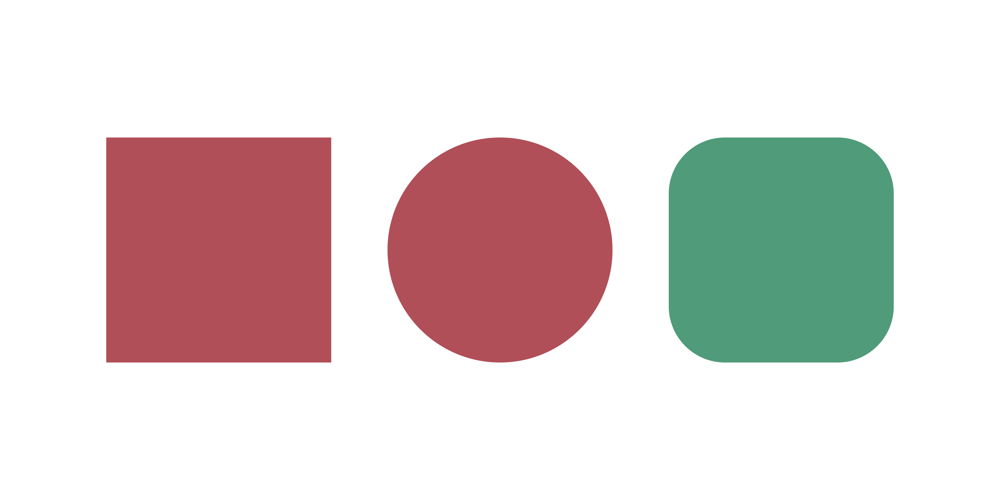

# Contributing to Willow Icons

## License

By submitting a pull request, you agree that your contribution will be licensed under the MIT License and included in this project under the same terms.

All contributors retain authorship of their work.

---

# About the Willow Icons Project

Willow Icons is a community-friendly project focused on developing and maintaining icons to create a consistent and well-designed user experience.

In addition to icons, the project includes a companion app, documentation, and tools to support and improve the project.

Contributions of all kinds are welcome, whether icons, code, documentation, or ideas.

---

# Icon Design Rules

## Base Shape System

All icons in Willow Icons use the same base shape system.

### Required Parameters

* Icon size: **168×168 px**
* Corner radius: **42 px**
* Canvas size: **192×192 px**
* Padding: **12 px** on each side
* Icons must be centered on the canvas

The outer silhouette must remain visually consistent across the entire icon pack.

---

# Color Palette

All icons must use the official Willow color palette.

### Rules

* Use only colors from the palette below
* Gradients are not allowed
* Avoid overly saturated or neon colors
* Keep the visual style soft and balanced


| Color | Primary | Dark |
|---------|---------|---------|
| Blue | $\textcolor{#5F97C9}{\textsf{⬤}}$ `#5F97C9` | $\textcolor{#3F79AD}{\textsf{⬤}}$ `#3F79AD` |
| Indigo | $\textcolor{#6F7FC0}{\textsf{⬤}}$ `#6F7FC0` | $\textcolor{#4F5F9F}{\textsf{⬤}}$ `#4F5F9F` |
| Purple | $\textcolor{#8A78C8}{\textsf{⬤}}$ `#8A78C8` | $\textcolor{#6B58A7}{\textsf{⬤}}$ `#6B58A7` |
| Red | $\textcolor{#D06F78}{\textsf{⬤}}$ `#D06F78` | $\textcolor{#B04F58}{\textsf{⬤}}$ `#B04F58` |
| Orange | $\textcolor{#D2945A}{\textsf{⬤}}$ `#D2945A` | $\textcolor{#B0733F}{\textsf{⬤}}$ `#B0733F` |
| Yellow | $\textcolor{#D1C06A}{\textsf{⬤}}$ `#D1C06A` | $\textcolor{#B8A64F}{\textsf{⬤}}$ `#B8A64F` |
| Green | $\textcolor{#6FBF9A}{\textsf{⬤}}$ `#6FBF9A` | $\textcolor{#4F9B7A}{\textsf{⬤}}$ `#4F9B7A` |
| Teal | $\textcolor{#63B2A8}{\textsf{⬤}}$ `#63B2A8` | $\textcolor{#438F86}{\textsf{⬤}}$ `#438F86` |
| Cyan | $\textcolor{#63A8C2}{\textsf{⬤}}$ `#63A8C2` | $\textcolor{#428AA3}{\textsf{⬤}}$ `#428AA3` |
| Pink | $\textcolor{#C07FA0}{\textsf{⬤}}$ `#C07FA0` | $\textcolor{#9F5F7F}{\textsf{⬤}}$ `#9F5F7F` |
| Brown | $\textcolor{#9F897A}{\textsf{⬤}}$ `#9F897A` | $\textcolor{#7F6B5D}{\textsf{⬤}}$ `#7F6B5D` |
| Gray | $\textcolor{#8A8F98}{\textsf{⬤}}$ `#8A8F98` | $\textcolor{#6B7078}{\textsf{⬤}}$ `#6B7078` |
| Neutral | $\textcolor{#F4F5F7}{\textsf{⬤}}$ `#F4F5F7` | $\textcolor{#32363B}{\textsf{⬤}}$ `#32363B` |


---

# File Formats

## Source Icons

Format:

```text
.svg
```

Location:

```text
/icons
```

---

## Exported Icons

Format:

```text
.png
```

Requirements:

* 192×192 px

Location:

```text
/app/src/main/res/drawable-nodpi
```

---

# Naming Rules

## Prefixes

* `app_` — applications
* `sys_` — system icons

## Rules

* lowercase letters only
* underscores allowed
* no spaces
* no camelCase

## Examples

```text
app_telegram.svg
app_spotify.svg
sys_camera.svg
sys_settings.svg
```

---

# Launcher Support

Every new icon should include launcher support entries whenever applicable.

---

## 1. Add SVG Source

Place the source file inside:

```text
/icons
```

Example:

```text
app_telegram.svg
```

---

## 2. Add PNG Export

Export the icon as:

* 192×192 px
* PNG format

Place it inside:

```text
/app/src/main/res/drawable-nodpi
```

Example:

```text
app_telegram.png
```

---

## 3. Add drawable.xml Entry

File:

```text
/app/src/main/res/xml/drawable.xml
```

Add:

```xml
<item drawable="app_telegram" />
```

---

## 4. Add appfilter.xml Entry

File:

```text
/app/src/main/res/xml/appfilter.xml
```

Add:

```xml
<!-- Telegram -->
<item component="ComponentInfo{org.telegram.messenger/org.telegram.ui.LaunchActivity}" drawable="app_telegram" />
```

---

# Component Mapping

Component information can be obtained from:

* Willow Icons icon request system
* Verified third-party appfilters

Unknown component mappings should not be guessed.

---

# Scripts and Automation

Scripts are available to help maintain project consistency and simplify common tasks.

Contributors are encouraged to use them before opening a Pull Request.

---

## verify.py

Generates a project consistency report.

Checks:

* SVG files
* PNG files
* drawable.xml entries
* appfilter.xml entries
* missing mappings
* orphan entries

Example:

```text
=== VERIFY REPORT ===

SVG: 189
PNG: 189
DRAWABLE XML: 190
APPFILTER: 187

MISSING PNG (SVG → PNG):
- OK

ORPHAN PNG:
- OK

MISSING DRAWABLE XML:
- app_nekogram
- app_google_password_manager

ORPHAN DRAWABLE XML:
- app_nekogram_dark
- app_nekogram_light

MISSING APPFILTER:
- app_google_health_connect
- app_google_play_services
- app_microsoft_authenticator

ORPHAN APPFILTER:
- app_nekogram
```

---

## sort.py

Automatically:

* sorts drawable names
* organizes icons into categories

---

# Code Modification Rules

Any code changes should include clear modification notes.

---

## Required Markers

```java
// add: added new functionality
// fix: fixed existing functionality
// del: removed obsolete code
```

Examples:

```java
// add: added Niagara launcher support
```

```java
// fix: corrected activity resolution
```

---

# AI Generated Content

AI-generated contributions are allowed.

If generated code has not been fully reviewed, it should be marked accordingly.

## Recommended Markers

```java
// AI GENERATED CODE: needs review
```

```java
// AI GENERATED FILE: needs review
```

## Example

```java
// add: added Yagni launcher support

YAGNI( // AI GENERATED CODE: needs review
    "Yagni",
    R.drawable.ic_launcher_yagni,
    new String[]{"com.eblan.launcher"},
    "com.eblan.launcher.activity.settings.SettingsActivity",
    DIRECT_APPLY_NOT_SUPPORTED,
    (context, launcherName) -> new String[]{}
),
```

---

# Exceptions

If a contribution intentionally breaks one or more rules:

* explain the reason
* identify the affected rule
* describe possible alternatives

Pull requests without explanation may be rejected.

---

# Improving the Rules

If you believe a rule should be changed:

* open an issue
* explain the problem
* propose an alternative

Reasonable suggestions are welcome.

---
