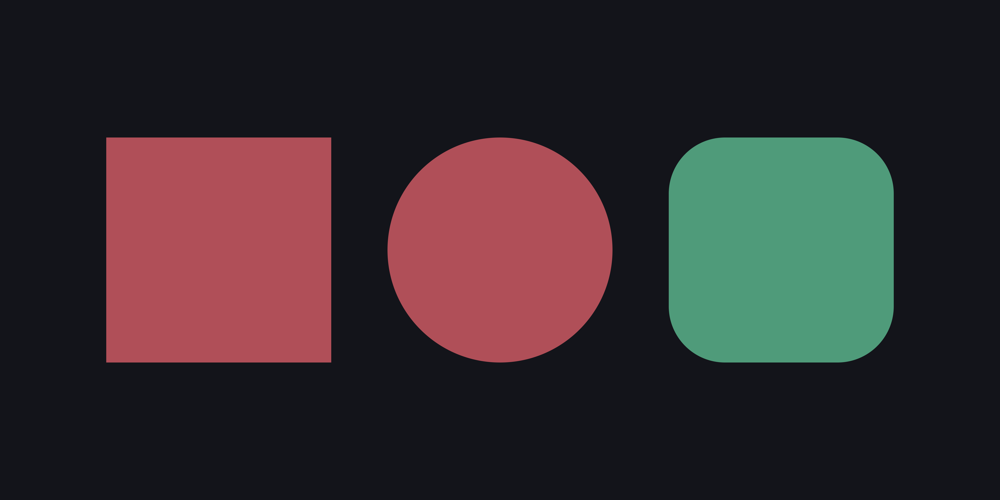
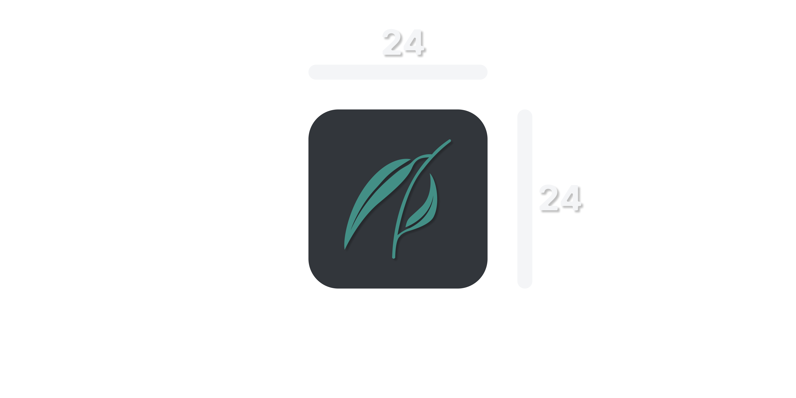
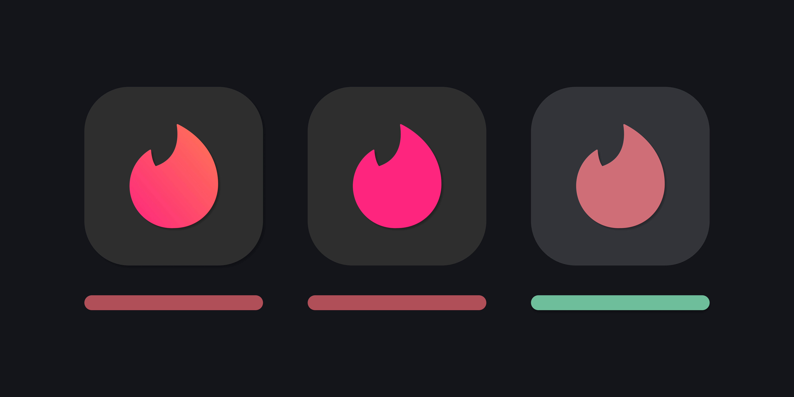

# Contributing to Willow Icons

## License

By submitting a pull request, you agree that your contribution will be licensed under the MIT License and included in this project under the same terms.

All contributors retain authorship attribution.

---

## Icon design rules

### 1. Base shape system

* All icons must use a single base shape system.
* Only internal content may vary.
* Outer silhouette must remain consistent across the pack.

### 2. Format

* **SVG only**.
* No raster formats (no PNG, JPG, or WEBP).

### 3. Canvas size

* All icons must be designed on a fixed **24×24** canvas.
* Elements must be aligned to the grid and centered.

### 4. Naming convention

* Use prefix-based naming (e.g., `app_`, `sys_`).
* **lowercase only**, underscores allowed.
* No spaces or mixed casing.

### 5. Style rules

* **Flat / minimal design** only.
* Use the standard color palette.
* Must visually match the existing Willow style (muted tones, clean lines).

---

## Color palette

## Color palette

| Name            | Hex     |
|-----------------|---------|
| Blue            | #5F97C9 |
| Blue Dark       | #3F79AD |
| Indigo          | #6F7FC0 |
| Indigo Dark     | #4F5F9F |
| Purple          | #8A78C8 |
| Purple Dark     | #6B58A7 |
| Red             | #D06F78 |
| Red Dark        | #B04F58 |
| Orange          | #D2945A |
| Orange Dark     | #B0733F |
| Yellow          | #D1C06A |
| Yellow Dark     | #B8A64F |
| Green           | #6FBF9A |
| Green Dark      | #4F9B7A |
| Teal            | #63B2A8 |
| Teal Dark       | #438F86 |
| Cyan            | #63A8C2 |
| Cyan Dark       | #428AA3 |
| Pink            | #C07FA0 |
| Pink Dark       | #9F5F7F |
| Brown           | #9F897A |
| Brown Dark      | #7F6B5D |
| Gray            | #8A8F98 |
| Gray Dark       | #6B7078 |
| Black           | #32363B |
| White           | #F4F5F7 |
---

## Rule exceptions

If your contribution does not follow one or more of the rules above, you must:

* Clearly explain why the rule was not followed.
* Describe the limitation or issue in the current system.
* Suggest a possible improvement if applicable.

Contributions without explanation may be rejected.

---

## Improving the system

If you believe a rule is incorrect, outdated, or limiting:

* Open an issue or explain it in your pull request.
* Provide reasoning and examples.

The design system is allowed to evolve, but changes must be intentional.
