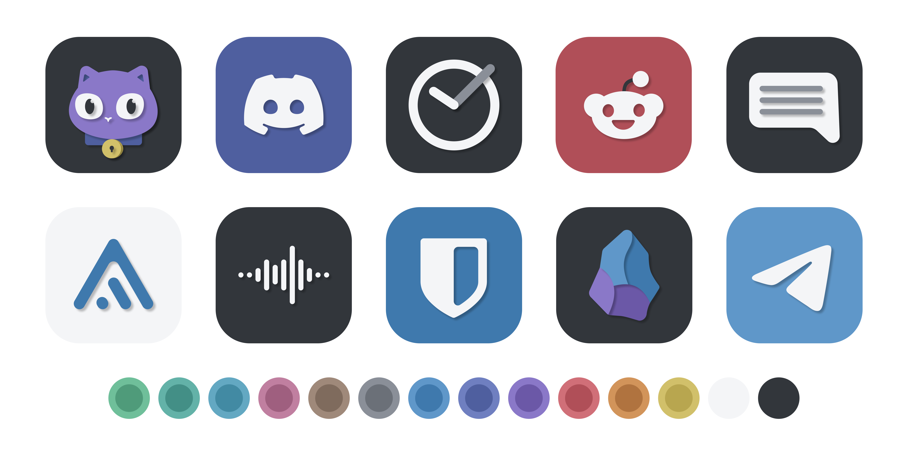

# Willow Icons

---

## About

Willow Icons is an open-source icon pack built around consistency, simplicity, and a unified visual style.

The goal of the project is to create icons that feel like they belong together. Every icon follows the same shape system, spacing rules, and color palette to provide a cohesive experience across the entire pack.

In addition to icons, the project also includes a companion app, documentation, and tools used to maintain the project.

### Features

* Consistent icon shape system
* Unified spacing and proportions
* Minimalistic color palette
* Launchers support
* SVG source files included

---

## Contributing

Contributions of all kinds are welcome.

Whether you'd like to create icons, work on the application, improve documentation, or help with project tooling, your contributions are welcome.

Before submitting a Pull Request, please read:

**[CONTRIBUTING.md](CONTRIBUTING.md)**

## License

This project is licensed under the MIT License.

See:

* [LICENSE](LICENSE)
* [NOTICE](NOTICE)

Willow Icons is an open-source icon pack built around consistency, simplicity, and a unified visual style.

The goal of the project is to create icons that feel like they belong together. Every icon follows the same shape system, spacing rules, and color palette to provide a cohesive experience across the entire pack.

In addition to icons, the project also includes a companion app, documentation, and tools used to maintain the project.

### Features

* Consistent icon shape system
* Unified spacing and proportions
* Minimalistic color palette
* Launchers support
* SVG source files included

---

## Contributing

Contributions of all kinds are welcome.

Whether you'd like to create icons, work on the application, improve documentation, or help with project tooling, your contributions are welcome.

Before submitting a Pull Request, please read:

**[CONTRIBUTING.md](CONTRIBUTING.md)**

## License

This project is licensed under the MIT License.

See:

* [LICENSE](LICENSE)
* [NOTICE](NOTICE)